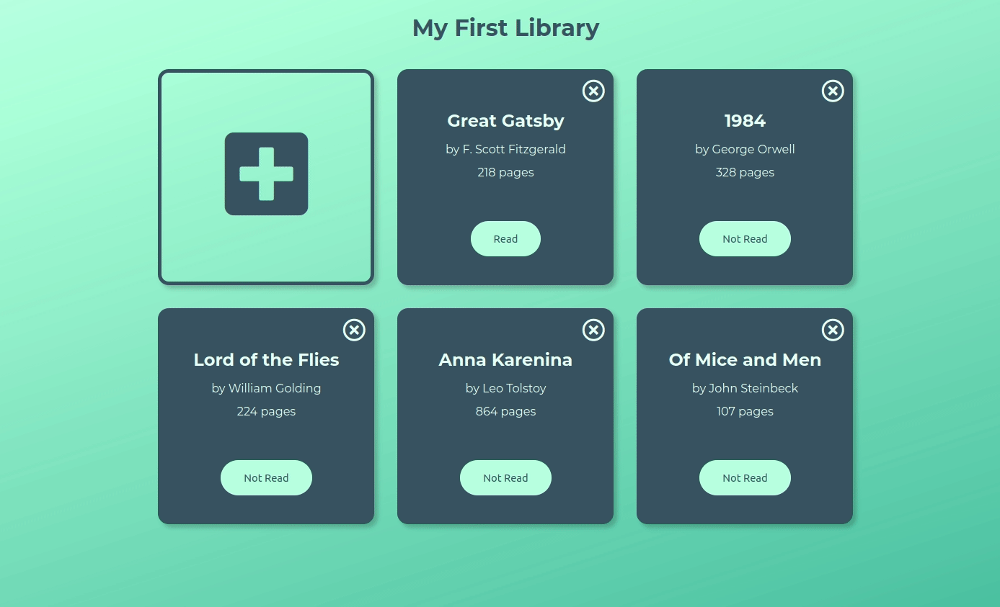

# Project: Library
An Javascript Object project for [The Odin Project Ruby on Rails Course](https://www.theodinproject.com/courses/javascript/lessons/library) to implement a book management website by leveraging Javascript Objects. 

## Features 
Users are able to see pre-existing books in the library, which are persistantly stored in a [Firebase Realtime Database](https://firebase.google.com/). Books can be added via the form, which is shown when the add button is clicked. The read status of the book, once created, can be toggled. Additionally, books can be removed if so desired. 

## Demo 
Check out the live version [here](https://zxum.github.io/library/)

## Reflections 
This project made me fall in love with Javascript. I now understand why this language is so popular! My favorite aspect of this project was implementing and connecting Firebase as the storage option. I challenged myself to use Firebase because I wanted real hands-on experience using Google Cloud products that are geared for Developers. I used the Realtime Database from Firebase for this project, and it was so amazing watching the database sync in realtime. Absolutely love the tool! 10/10 would recommend! 

One aspect that I struggled with, but conquered in the end was the event handling of dynamically generated elements. I had no idea why I couldn't access parts inside the Book divs, but then I learned about event delegation. With some trial and error I figured it out and fixed the feature! Such a good feeling! 